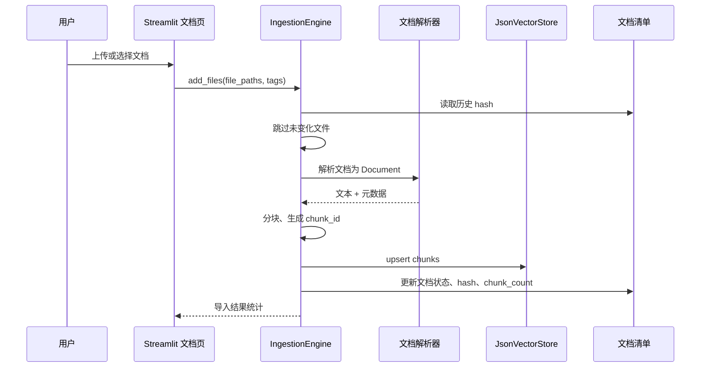
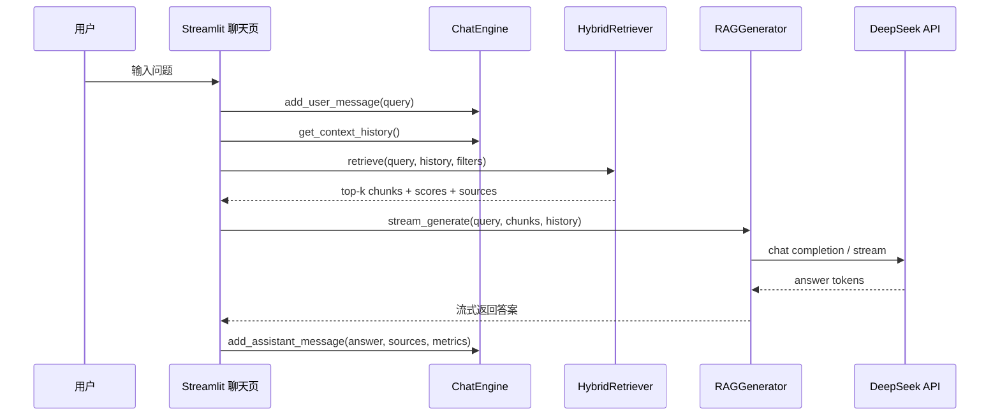

# Co-Thinker 架构与技术方案

## 1. 项目定位

Co-Thinker 是一个面向特定领域知识库的 RAG（Retrieval-Augmented Generation）智能问答系统。它的目标不是做通用聊天机器人，而是围绕用户导入的文档集合，完成“可追溯、可更新、可多轮追问”的知识问答。

README 中定义的核心能力包括：

- 知识库构建与管理：支持 md、txt、代码文件等格式批量导入、分类标注与更新。
- 精准语义检索：结合意图解析、关键信息提取和语义向量检索。
- RAG 答案生成：将检索上下文注入大模型，生成自然、可信、带来源的答案。
- 多轮对话上下文管理：支持追问、省略主语、围绕同一主题连续交流。
- 可视化交互界面：面向本地或轻量团队使用，优先通过 Streamlit 快速交付。

## 2. 范围与阶段

### 2.1 MVP 范围（P0）

MVP 以“单机可运行、文档可导入、问题可回答、来源可追溯”为目标：

1. 本地 Streamlit UI。
2. 文档导入：`.md`、`.txt`、常见代码文件（如 `.py`、`.js`、`.ts`、`.java`、`.go`、`.rs`、`.mdx`）。
3. 文档分块、元数据抽取、向量化并持久化到 JsonVectorStore（自定义 JSON 向量存储）。
4. 向量检索 + BM25 关键词检索的混合召回。
5. DeepSeek Chat 生成答案，OpenAI embedding 生成向量。
6. 答案包含引用来源、相关片段和低置信度提示。
7. 多轮对话历史保存在本地 JSON 文件。

### 2.2 增强范围（P1）

1. 支持 PDF、DOCX、PPTX、CSV、JSON/YAML 等更多格式。
2. 查询意图解析与查询改写：从多轮上下文中补全用户当前问题。
3. RRF 融合参数可配置，支持按文件类型、标签、目录过滤。
4. 对话历史摘要压缩，避免上下文过长。
5. 文档级更新检测：文件 hash 不变则跳过重建。
6. 简单检索评测集与回归测试。

### 2.3 后续演进（P2）

1. 多知识库隔离与知识库切换。
2. 用户登录、权限隔离和团队共享。
3. 后端 API 服务化（FastAPI）与异步任务队列。
4. 本地 embedding 模型或私有化模型部署。
5. 更严格的 RAG 质量评估、自动化 benchmark 和监控。

## 3. 非功能性要求（NFR）

| 类别 | MVP 目标 | 说明 |
| --- | --- | --- |
| 性能 | 普通问题端到端 3-10 秒内返回首段答案 | LLM API 是主要耗时；使用流式输出降低等待感 |
| 检索延迟 | 1000-10000 chunks 下检索 < 1 秒 | 单机 ChromaDB + BM25 足够支撑早期规模 |
| 数据规模 | 单知识库 100-1000 个文档、10k-100k chunks | 超过该范围后再考虑服务化与专用向量库 |
| 可用性 | 本地单机可恢复运行 | 重点保证重启后向量库、文档清单、对话历史不丢失 |
| 安全 | API Key 不入库、不进日志、不提交 Git | `.env` 和 Streamlit secrets 均应被 `.gitignore` 排除 |
| 可维护性 | 模块边界清晰、核心流程可单测 | 配置、导入、检索、生成、对话、UI 分层实现 |
| 可观测性 | 最少记录导入、检索、生成耗时与错误 | MVP 可用日志文件；P1 再考虑结构化日志和指标 |
| 成本 | 控制 embedding 和 LLM 调用次数 | 增量导入、hash 去重、top-k 和上下文预算控制是关键 |

## 4. 架构模式选择

采用“模块化单体 + 本地持久化”的架构：

- 单进程 Streamlit 应用负责 UI 与编排。
- 业务逻辑拆分为独立 Python 模块，避免把所有逻辑写在 UI 文件中。
- 数据持久化使用本地目录：源文档、向量库、BM25 索引、对话历史、文档清单。
- 暂不引入微服务、消息队列和独立数据库，降低早期复杂度。

该选择适合当前项目：需求清晰、团队/个人开发、强调快速落地和本地使用。若未来需要多人共享、权限控制或大规模文档处理，再演进为 FastAPI 后端 + 异步任务 + 独立数据库。

## 5. 高层架构图

```mermaid
graph TD
    U[用户] --> UI[Streamlit UI]

    subgraph UI_LAYER[界面层]
        UI --> DocsPage[文档管理页]
        UI --> ChatPage[对话问答页]
        UI --> SettingsPage[系统设置页]
    end

    subgraph APP_LAYER[应用/业务层]
        DocsPage --> Ingest[IngestionEngine\n文档导入与索引构建]
        ChatPage --> Chat[ChatEngine\n会话与历史管理]
        ChatPage --> Retriever[HybridRetriever\n意图解析与混合检索]
        ChatPage --> Generator[RAGGenerator\nPrompt 组装与答案生成]
        SettingsPage --> Config[Settings\n配置与客户端初始化]
    end

    subgraph STORAGE_LAYER[本地持久化层]
        Ingest --> SourceDocs[(data/\n源文档)]
        Ingest --> Manifest[(storage/document_manifest.json\n文档清单)]
        Ingest --> VectorStore[(vectorstore/chunks.json\n向量与文本存储)]
        Chat --> History[(storage/chat_history.json\n对话历史)]
    end

    subgraph EXTERNAL[外部模型服务]
        Config --> DeepSeek[DeepSeek Chat API\n(生成答案)]
    end

    Retriever --> VectorStore
    Generator --> DeepSeek
```

## 6. 核心运行流程

### 6.1 文档导入流程



### 6.2 问答流程



## 7. 目录结构规划

```text
co-thinker/
├── README.md
├── requirements.txt
├── .env.example
├── config.py
├── app/
│   ├── __init__.py
│   ├── ingest.py
│   ├── retriever.py
│   ├── generator.py
│   ├── chat_engine.py
│   └── streamlit_app.py
├── data/                       # 用户导入的源文档，不建议提交
├── vectorstore/                # chunks.json 向量与文本存储，不提交
├── storage/
│   ├── document_manifest.json  # 文档清单、hash、状态
│   └── chat_history.json       # 对话历史
├── tests/
│   ├── fixtures/
│   ├── test_config.py
│   ├── test_ingest.py
│   ├── test_retriever.py
│   ├── test_generator.py
│   └── test_chat_engine.py
└── plans/
    ├── 01-architecture-overview.md
    ├── 02-config-module.md
    ├── 03-ingest-module.md
    ├── 04-retriever-module.md
    ├── 05-generator-module.md
    ├── 06-chat-engine-module.md
    ├── 07-streamlit-app.md
    ├── 08-implementation-roadmap.md
    ├── 09-testing-and-operations.md
    └── 10-architecture-decisions.md
```

## 8. 模块边界

| 模块 | 职责 | 不负责 |
| --- | --- | --- |
| `config.py` | 环境变量、路径、模型客户端、参数校验 | UI 表单、业务流程 |
| `app/ingest.py` | 文件解析、分块、元数据、向量入库、索引更新 | 用户交互、答案生成 |
| `app/retriever.py` | 查询改写、向量检索、BM25 检索、融合排序、过滤 | 文档解析、LLM 最终回答 |
| `app/generator.py` | Prompt 组装、上下文预算、流式生成、引用整理 | 检索算法、对话存储 |
| `app/chat_engine.py` | 会话、消息、历史截断、持久化、摘要策略 | UI 展示、模型客户端配置 |
| `app/streamlit_app.py` | 页面布局、用户操作编排、状态缓存、错误提示 | 核心算法实现 |

## 9. 技术栈建议

| 层级 | 技术 | 选择理由 | 风险/备注 |
| --- | --- | --- | --- |
| 语言 | Python 3.12+ | AI/RAG 生态成熟；依赖兼容性较好 | 若使用 3.13 需确认 LlamaIndex/Chroma 兼容 |
| UI | Streamlit | 快速构建本地交互界面 | 不适合复杂权限和高并发 |
| RAG 编排 | LlamaIndex | 文档加载、节点、向量库集成成熟 | API 版本变化较快，需要锁定版本 |
| 向量库 | JsonVectorStore（自定义 JSON） | 零额外依赖、原子写入、便于调试 | 10k+ chunks 需迁移到 FAISS 或 Qdrant |
| LLM | DeepSeek Chat | 成本相对友好，OpenAI 兼容接口 | 需要处理限流、超时和 API 错误 |
| 检索算法 | BM25 + token 重叠 | 无需外部 API，零额外依赖 | 缺乏语义向量，对同义词表达不敏感 |
| Token 分词 | 正则规则分词 | 同时支持中文单字和英文 token | 精确度不如 jieba 或分词器 |
| 配置 | `.env` + `pydantic`/dataclass | 易用、可校验 | API Key 不能写入日志 |

## 10. 关键质量策略

1. **可追溯**：每个 chunk 必须携带 `source_path`、`file_name`、`chunk_id`、`document_id` 等元数据。
2. **可更新**：文档清单记录 hash、mtime、chunk_count，支持增量导入和删除。
3. **可解释**：检索结果保留原始分数、融合分数、检索来源（vector/bm25）。
4. **可控成本**：对文档导入做 hash 去重；对生成做上下文 token 预算；对 top-k 做上限。
5. **可测试**：核心模块不依赖 Streamlit，可用 fixtures 单测。
6. **不编造**：Prompt 明确要求基于上下文回答；低置信度或无命中时返回无法回答提示。

## 11. 主要风险与缓解

| 风险 | 影响 | 缓解 |
| --- | --- | --- |
| 文档解析失败或乱码 | 知识库缺失内容 | 为每个文件记录导入状态和错误；UI 展示失败列表 |
| chunk 过大或过小 | 影响召回和生成质量 | 默认 800 tokens 左右，保留 overlap；用测试集调参 |
| 检索命中但答案仍幻觉 | 用户信任下降 | 强制引用来源；无来源不输出确定性结论；回答中标注“知识库未覆盖” |
| API 限流/超时 | 导入或问答失败 | 批量 embedding 限速、重试、超时提示；UI 可重试 |
| Streamlit 重渲染导致状态混乱 | 用户体验差 | 引擎实例放入 `st.session_state`，耗时操作显式 status |
| 删除文件后索引残留 | 答案引用已删除内容 | 基于 `document_id` 删除所有 chunks，并更新 manifest |
| API Key 泄露 | 安全事故 | `.env` 不提交；输入框 type=password；日志脱敏 |

## 12. 验收标准

MVP 完成时至少满足：

- 可以从 UI 批量导入 `.md`、`.txt` 和常见代码文件。
- 导入后可看到文档数、chunk 数、失败文件列表。
- 用户提问后能检索到相关片段并流式生成答案。
- 答案展示引用来源，来源能对应到具体文件和 chunk。
- 支持新建/切换/删除会话，重启应用后历史仍存在。
- 修改或删除源文件后重建索引不会保留旧 chunk。
- 核心模块有基础单元测试，至少覆盖配置、导入、检索融合、对话持久化。
